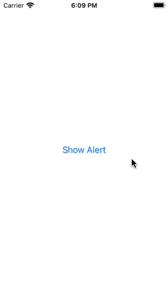

# QCAlertView

Tried creating repeted AlertView's ? try "QCAlertView" instead!

Easily create and show alert views without writing much code

```
        QCAlertView.shared.showAlert(self, withTitle: "QCAlertView Example", alertList: [
            
            QCAlertView.Alert.init(name: "default action", type: .default, action: {}),
            QCAlertView.Alert.init(name: "destructive action", type: .destructive, action: {}),
            QCAlertView.Alert.init(name: "cancel action", type: .cancel, action: {})
        
        ])
```


